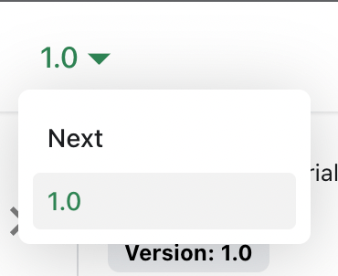

# 管理文档版本

Docusaurus 可以管理文档的多个版本。

## 创建文档版本

发布你的项目 1.0 版本：

```bash
npm run docusaurus docs:version 1.0
```

`docs` 目录会被复制到 `versioned_docs/version-1.0`，并生成一个 `versions.json` 文件。

你的文档现在拥有 2 个版本：

- `1.0` 位于 `http://localhost:3000/docs/`，对应 1.0 版本的文档
- `current` 位于 `http://localhost:3000/docs/next/`，对应 **即将发布、未发布的文档**

## 添加版本下拉菜单

要在不同版本之间无缝切换，可以添加一个版本下拉菜单。

修改 `docusaurus.config.js` 文件：

```js title="docusaurus.config.js"
export default {
  themeConfig: {
    navbar: {
      items: [
        // highlight-start
        {
          type: 'docsVersionDropdown',
        },
        // highlight-end
      ],
    },
  },
};
```

文档版本下拉菜单会出现在导航栏中：



## 更新已有版本

可以直接在对应文件夹中编辑已版本化的文档：

- `versioned_docs/version-1.0/hello.md` 对应 `http://localhost:3000/docs/hello`
- `docs/hello.md` 对应 `http://localhost:3000/docs/next/hello`
